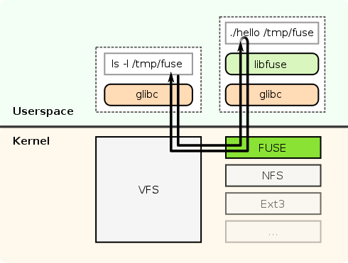

 # 操作系统实验5报告 - 文件系统

[toc]

## Overview

本实验要求实现一个基于 FUSE 框架的，类似 EXT2 的文件系统，实现超级块、数据位图、索引位图等主要结构，并可选实现磁盘缓存、文件系统日志等功能。

在本实验中，本项目完成了一个基于 Rust 语言和 [fuse-rs](https://github.com/chiro2001/fuse-rs) 框架的兼容 Ext2 rev 0.0 大部分功能的用户文件系统。

### 实现的功能

1. 文件/文件夹的创建、读写、删除
2. 时间戳的查询和更新
3. 大文件支持
4. 创建文件系统，文件系统格式化
5. 文件系统缓存
6. 软链接

经测试，大部分软件可以在此文件系统上运行，如 VsCode、GCC 等。

## 源代码结构

本项目由两个 git 仓库组成，仓库 [rfs](https://github.com/chiro2001/rfs) 是 仓库 [fuse-extfs](https://github.com/chiro2001/fuse-extfs) 的子项目。fuse-extfs 属于 HITsz 操作系统实验 5 框架，rfs 可以通过静态链接的方式在 fuse-extfs 内运行。

项目中有四个 Rust crate：

1. `fs/rfs/rfs_bind`，位于 `fuse-ext2` repo 内
   1. 用于将实验提供的 `ddriver` 静态库和 `rfs` 编译到一起形成一个新的静态库 `rfs_bind_lib`
   2. `ddriver` 静态库将包裹为 Rust `struct DDriver`
   3. 同时需要转换 `fuse-rs` 库和 `fuse` C/C++框架之间的 API 逻辑
   4. 编译生成的静态库将交给原实验框架继续和 `rfs.cpp` 一起编译
2. `disk_driver`，位于 `rfs` repo 内
   1. 用于提供磁盘驱动的抽象接口 `trait DiskDriver`
   2. 同时提供了两个简单的磁盘驱动实现，一个是只在内存实现的 `MemoryDiskDriver`，另一个是读写单个文件的 `FileDiskDriver`
3. `src/macro_tools`，位于 `rfs` repo 内
   1. 用于提供一些宏工具
   2. 独立出来的原因是一些导出的宏不允许自身为静态类 crate
4. `rfs`，即 `rfs` repo 自身
   1. 是文件系统的主要逻辑
   2. 通过 `trait DiskDriver` 实现编译期多态
   3. 其同时可编译成静态库 `rfs_lib` 和可执行文件 `rfs`
   4. 编译成可执行文件 `rfs` 时不需要依赖原项目框架的 `ddriver`，是可以独立运行的

原框架中的项目链接了静态库 `rfs_bind_lib`，所以 `rfs.cpp` 中不含有文件系统逻辑，仅含有向 Rust 端的函数调用。

其中，`rfs.cpp` 和 `rfs_bind` 侧使用的是 FUSE 的 `fuse_operations` 接口，主要逻辑基于文件路径；而 `rfs` 侧使用的是 `fuse_lowlovel_ops` 接口，其基于文件号等。于是在 `rfs` 侧可以独立运行的版本完成的功能更多如软链接、文件删除等，而 `rfs_bind` 侧只完成了基础功能，如文件创建、读写等。

由于项目中使用了 FUSE 的一些高级功能，所以需要 FUSE 3 以上版本，在 CMakeLists.txt 中需要额外链接 `libfuse3.so`。

## 实验原理

### 虚拟磁盘驱动

实验中使用一个 `ddriver` 静态库提供了虚拟磁盘驱动，提供了一个虚拟的容量为 4MiB 的磁盘，每次按块访问 512 字节。

为了 `rfs` 能够独立工作，项目中使用 `FileDiskDriver` 实现了 `trait DiskDriver`，提供了每次 512 字节按块访问的虚拟磁盘接口。经过测试，从 128 KiB 到 4 GiB 等不同容量下，文件系统都能正常运行。

### Ext2 文件系统

[Ext2 (The Second Extended File System)](https://docs.kernel.org/filesystems/ext2.html)，最初于 1993 年 1 月发布。由 R'emy Card、Theodore Ts'o 和 Stephen Tweedie 编写，它是对扩展文件系统的重大改写。目前它仍然是 Linux 使用的主要文件系统之一。

Ext2 与传统的 Unix 文件系统共享许多属性。它具有块、索引节点和目录的概念。它在访问控制列表 (ACL)、片段、取消删除和压缩的规范中有空间，尽管这些尚未实现（一些作为单独的补丁提供）。还有一个版本控制机制，允许以最大兼容的方式添加新功能（例如日志记录）。

### FUSE 框架



[FUSE (Userspace Filesystem)](https://www.kernel.org/doc/html/latest/filesystems/fuse.html) 架构实现了让用户空间提供文件系统的数据、结构和访问方式，而内核提供文件访问方法，于是我们可以通过提供 FUSE 框架的钩子函数完成我们的文件系统的实现和测试，通过挂载用户文件系统的方法与系统本身的文件系统共存。

## 文件系统设计

为了发挥项目的实用性，同时也方便测试，本项目基于 Ext2 rev 0.0 文件系统，实现了其大部分功能。

### 布局设计

对于 Ext2 文件系统而言，磁盘大小、文件系统块大小、磁盘布局并不是固定的。在项目测试中使用的对应 4 MiB 磁盘大小的文件系统布局：

```
# For 4 MiB fs
| BSIZE = 1024 B |
| Boot(1) | Super(1) | GroupDesc(1) | DATA Map(1) | Inode Map(1) | Inode Table(128) | DATA(*) |
```

1. BSIZE：块大小；本项目中实现的文件系统支持 1 KiB、2 KiB、4 KiB 等块大小，这里使用 1 KiB。

2. Boot 块：为了兼容旧电脑平台，这一个文件系统块是为了 MBR 启动准备的，可以储存磁盘引导记录或者分区引导记录。

3. Super 块：文件系统超级块，储存当前文件系统的布局等信息。

   

4. GroupDesc 块：block group descriptor table，储存当前文件系统中每个 block group 对应的 block group descriptor。在本实现中假定了总共只有一个 block group。

   

5. DATA Map 块：储存 block bitmap 的块

6. Inode Map 块：储存 inode bitmap 的块

7. Inode Table 共 128 块：储存 inode 信息的块。每个 inode 大小为 128 字节，每个 1 KiB 块能储存 8 个，总共 1024 个 inode。

8. DATA 块：剩下的块都是储存文件数据和文件夹数据的块

以上是在项目测试中使用的文件布局。项目中暂未支持通过估计磁盘大小来动态调整布局参数，故对其他大小的磁盘可以使用 Linux 工具 `mkfs.ext2` 完成。通过 `mkfs.ext2` 在文件中建立一个参数自动的 Ext2 rev 0.0 文件系统：

```bash
mkfs.ext2 ~/ddriver -t ext2 -r 0
```

经测试其和本项目中的文件系统是兼容的。不过因为其会占用部分保留 inode 和 data block，而且会生成 `lost+found`，故测试时还需要使用程序内的格式化逻辑。

除了测试中使用的 4 MiB 大小的文件系统，我们可以这样创建 1GiB 大小的文件系统：

```bash
$ cargo run --release --package rfs -- -f /home/chiro/mnt --format -c --cache_size 128 -l include/fs-1GiB.layout -s 1024  
    Finished release [optimized] target(s) in 0.07s
     Running `target/release/rfs -f /home/chiro/mnt --format -c --cache_size 128 -l include/fs-1GiB.layout -s 1024`
[2022-12-13T08:55:50Z INFO  rfs] Device: ddriver
[2022-12-13T08:55:50Z INFO  rfs] [try 1/3] Mount to /home/chiro/mnt
[2022-12-13T08:55:50Z WARN  disk_driver::file] FileDiskDriver new, path=, size=0x40000000, iosz=512
[2022-12-13T08:55:50Z INFO  fuser::session] Mounting /home/chiro/mnt
[2022-12-13T08:55:50Z INFO  disk_driver::file] FileDrv open: ddriver
[2022-12-13T08:55:52Z INFO  rfs::rfs_lib] disk layout size: 1073741824
[2022-12-13T08:55:52Z INFO  rfs::rfs_lib] disk unit size: 512
[2022-12-13T08:55:52Z INFO  rfs::rfs_lib] Disk ddriver has 2097152 IO blocks.
[2022-12-13T08:55:52Z INFO  rfs::rfs_lib] disk info: DiskInfo { stats: DiskStats { write_cnt: 0, read_cnt: 0, seek_cnt: 0 }, consts: DiskConst { read_lat: 2, write_lat: 1, seek_lat: 4, track_num: 0, major_num: 100, layout_size: 1073741824, iounit_size: 512 } }
[2022-12-13T08:55:52Z INFO  rfs::rfs_lib] super block size 2 disk block (1024 bytes)
[2022-12-13T08:55:52Z WARN  rfs::rfs_lib] Will format disk!
[2022-12-13T08:55:52Z INFO  rfs::rfs_lib] block_size = 4096
[2022-12-13T08:55:52Z INFO  rfs::rfs_lib] read fs.layout: FsLayoutArgs {
        block_count: 262144,
        block_size: 4096,
        boot: true,
        super_block: 1,
        group_desc: 2,
        data_map: 3,
        inode_map: 4,
        inode_table: 5,
        inode_count: 65536,
    }
[2022-12-13T08:55:52Z INFO  rfs::rfs_lib] super block size 2 disk block (1024 bytes)
[2022-12-13T08:55:52Z INFO  rfs::rfs_lib] fs stats: EXT2 65536 inodes, 4 KiB per block, free inodes 1013, free blocks 3806
[2022-12-13T08:55:52Z INFO  rfs::rfs_lib] fs layout:
[2022-12-13T08:55:52Z INFO  rfs::rfs_lib] | BSIZE = 4096 B |
[2022-12-13T08:55:52Z INFO  rfs::rfs_lib] | Boot(1) | Super(1) | GroupDesc(1) | DATA Map(1) | Inode Map(1) | Inode Table(2048) | DATA(*) |
[2022-12-13T08:55:52Z INFO  rfs::rfs_lib] For inode bitmap, see @ 4000
[2022-12-13T08:55:52Z INFO  rfs::rfs_lib] For  data bitmap, see @ 3000
```

其布局结构为：

```
| BSIZE = 4096 B |
| Boot(1) | Super(1) | GroupDesc(1) | DATA Map(1) | Inode Map(1) | Inode Table(2048) | DATA(*) |
```

### 索引设计

Ext2 文件系统使用复合的索引结构，即能够适应小文件也能适应大文件。`struct Ext2INode` 结构中的字段 `pub i_block: [u32; EXT2_N_BLOCKS]` 用于储存当前文件夹的文件夹项目，或者当前文件的数据块索引。`i_block` 的索引逻辑为：


其中有三类索引结构：

1. 第 0 到第 11 块是直接索引，每个字储存一个块索引。
2. 第 12 块是第一层间接索引，指向一个磁盘上储存了索引块的数组。
3. 第 13 块是第二层间接索引，指向了磁盘上一个储存了第一层间接索引数组的数组。
4. 第 13 块是第三层间接索引，指向了磁盘上一个储存了第二层间接索引数组的数组。

设当前文件系统块大小为 $a$，则最大文件大小为 $a\times(12+\frac{a}{4} + (\frac{a}{4})^2 + (\frac{a}{4})^3)$ 字节。

当读取到某一个块索引为 0，在本实验中的实现是标记为未分配块，读取的时候统一返回全 0 的块而不是去读取磁盘的第 0 块。

### 文件夹设计

类似于文件，文件夹的 `i_block[]` 储存的是文件夹项目所在的块。一个文件夹项目 `struct Ext2DirEntry` 的结构为：


1. `inode` 储存当前文件的 ino 号
2. `rec_len` 储存的是当前文件夹项目的长度，指向该文件夹的指针加上 `rec_len` 将会到达下一个块或者下一个文件夹项目
3. `name_len` 储存的是文件名长度。这里的文件名并不能使用 `'\0'` 判断是否为字符串尾部
4. `file_type` 储存的是文件类型，可以为普通文件、文件夹、软链接、块设备等
5. `name` 储存文件名，最长文件名长度 256 字节

一个文件夹项目占用大小由 `rec_len` 控制，大小不是固定的，在块内遍历时通过不断使指针加上 `rec_len` 来跳转到下一个项目。

### 其他文件系统设计

#### 软链接的实现

软链接可以看作一个特殊的文件，但是其在文件系统中的储存方式是和文件不同的。

由于软链接对性能要求较高，而且储存内容不多，所以不必为它分配一个块再在块中储存链接地址，而是直接将地址储存在 `i_block[]` 数组中。这样减少了文件系统空间的浪费，还提高了访问的性能。不过，这要求链接地址不能长于 60 字节，这对大部分情况是足够使用的。

### 磁盘缓存设计

#### 缓存结构设计

本实验中实现的缓存是一个简单的 LRU 缓存库 [lru-rs](https://github.com/jeromefroe/lru-rs)，其插入、查找、弹出的时间复杂度都为 $O(1)$（项目描述）。

其使用 HashMap 储存数据，使用链表管理 LRU 逻辑。在项目中，只需要每次从磁盘中读数据的时候将数据 `push` 到 `LruCache` 内，再将可能被弹出的最近未使用的块写回磁盘即可。具体实现请查看 [cache.rs](https://github.com/chiro2001/rfs/blob/master/disk_driver/src/cache.rs)。

#### 缓存性能对比测试

测试用脚本为 `tests/cache.py`，与实验指导书使用的基本一致。

关闭模拟磁盘延迟：

```
Test loop: 1000000, Cache Blks: 512
    Finished release [optimized] target(s) in 0.05s
     Running `target/release/rfs --format -q -c --cache_size 512 /home/chiro/mnt`
Time: 30815.510034561157ms BW: 253.52492920733374MB/s
Test loop: 100000, Cache Blks: 0
    Finished release [optimized] target(s) in 0.05s
     Running `target/release/rfs --format -q /home/chiro/mnt`
Time: 8691.662073135376ms BW: 89.88499477156695MB/s
```

在实验中我们可以打开磁盘延迟以进一步观察缓存的性能，使用的磁盘延迟参数如下。

```rust
impl Default for DiskConst {
    fn default() -> Self {
        Self {
            read_lat: 2,		// 读延迟 2ms
            write_lat: 1,		// 写延迟 1ms
            seek_lat: 4,		// 寻道延迟 4ms
            track_num: 0,
            major_num: 100,
            layout_size: 4 * 0x400 * 0x400,
            iounit_size: 512,
        }
    }
}
```

打开模拟磁盘延迟：

```
Test loop: 1000000, Cache Blks: 512
    Finished release [optimized] target(s) in 0.06s
     Running `target/release/rfs --format -q --latency -c --cache_size 512 /home/chiro/mnt`
Time: 30927.71863937378ms BW: 252.6051174707074MB/s
Test loop: 100, Cache Blks: 0
    Finished release [optimized] target(s) in 0.05s
     Running `target/release/rfs --format -q --latency /home/chiro/mnt`
Time: 9035.56513786316ms BW: 0.08646387780728894MB/s
```

由测试数据可知，磁盘经过一次缓存后文件系统读写性能大幅提升。在打开模拟磁盘延迟后尤其明显，未打开缓存的文件系统会频繁移动磁头，造成性能瓶颈，而一层缓存即可减少磁头的移动和实际的读写，显著提升系统性能。

[fuse-ext2](https://github.com/alperakcan/fuse-ext2) 是一个多操作系统 FUSE 模块，用于挂载 ext2、ext3 和 ext4 文件系统设备和/或具有读写支持的镜像文件。其经过了 8 年的开发，并有 30 位贡献者。与 fuse-ext2 进行性能比较：

```
fuse-ext2 Test loop: 1000000
Time: 10209.16724205017ms BW: 765.2436104505542MB/s
```

本实验中实现的文件系统还有较大的优化空间。

## 实验结果

运行所有测试的结果：

```bash
$ ./test.sh
开始mount, mkdir, touch, ls, read&write, cp, umount测试测试脚本工程根目录: /home/chiro/os/fuse-ext2/fs/rfs/rfs/tests
测试用例: /home/chiro/os/fuse-ext2/fs/rfs/rfs/tests/stages/mount.sh
测试用例: /home/chiro/os/fuse-ext2/fs/rfs/rfs/tests/stages/mkdir.sh
测试用例: /home/chiro/os/fuse-ext2/fs/rfs/rfs/tests/stages/touch.sh
测试用例: /home/chiro/os/fuse-ext2/fs/rfs/rfs/tests/stages/ls.sh
测试用例: /home/chiro/os/fuse-ext2/fs/rfs/rfs/tests/stages/remount.sh
测试用例: /home/chiro/os/fuse-ext2/fs/rfs/rfs/tests/stages/rw.sh
测试用例: /home/chiro/os/fuse-ext2/fs/rfs/rfs/tests/stages/cp.sh
============================================================================================================================    Finished dev [unoptimized + debuginfo] target(s) in 0.05s
     Running `/home/chiro/os/fuse-ext2/fs/rfs/rfs/target/debug/rfs --device=/home/chiro/ddriver -q /home/chiro/os/fuse-ext2/fs/rfs/rfs/tests/mnt`
pass: case 1 - mount
============================================================================================================================pass: case 2.1 - mkdir /home/chiro/os/fuse-ext2/fs/rfs/rfs/tests/mnt/dir0
pass: case 2.2 - mkdir /home/chiro/os/fuse-ext2/fs/rfs/rfs/tests/mnt/dir0/dir0
pass: case 2.3 - mkdir /home/chiro/os/fuse-ext2/fs/rfs/rfs/tests/mnt/dir0/dir0/dir0
pass: case 2.4 - mkdir /home/chiro/os/fuse-ext2/fs/rfs/rfs/tests/mnt/dir1
============================================================================================================================pass: case 3.1 - touch /home/chiro/os/fuse-ext2/fs/rfs/rfs/tests/mnt/file0
pass: case 3.2 - touch /home/chiro/os/fuse-ext2/fs/rfs/rfs/tests/mnt/file1
pass: case 3.3 - touch /home/chiro/os/fuse-ext2/fs/rfs/rfs/tests/mnt/dir0/file1
pass: case 3.4 - touch /home/chiro/os/fuse-ext2/fs/rfs/rfs/tests/mnt/dir0/file2
pass: case 3.5 - touch /home/chiro/os/fuse-ext2/fs/rfs/rfs/tests/mnt/dir1/file3
============================================================================================================================pass: case 4.1 - ls /home/chiro/os/fuse-ext2/fs/rfs/rfs/tests/mnt/
pass: case 4.2 - ls /home/chiro/os/fuse-ext2/fs/rfs/rfs/tests/mnt/dir0
pass: case 4.3 - ls /home/chiro/os/fuse-ext2/fs/rfs/rfs/tests/mnt/dir0/dir1
pass: case 4.4 - ls /home/chiro/os/fuse-ext2/fs/rfs/rfs/tests/mnt/dir0/dir1/dir2
============================================================================================================================    Finished dev [unoptimized + debuginfo] target(s) in 0.05s
     Running `/home/chiro/os/fuse-ext2/fs/rfs/rfs/target/debug/rfs --device=/home/chiro/ddriver -q /home/chiro/os/fuse-ext2/fs/rfs/rfs/tests/mnt`
pass: case 5.1 - umount /home/chiro/os/fuse-ext2/fs/rfs/rfs/tests/mnt
pass: case 5.2 - check bitmap
============================================================================================================================    Finished dev [unoptimized + debuginfo] target(s) in 0.06s
     Running `/home/chiro/os/fuse-ext2/fs/rfs/rfs/target/debug/rfs --device=/home/chiro/ddriver -q /home/chiro/os/fuse-ext2/fs/rfs/rfs/tests/mnt`
pass: case 6.1 - write /home/chiro/os/fuse-ext2/fs/rfs/rfs/tests/mnt/file0
pass: case 6.2 - read /home/chiro/os/fuse-ext2/fs/rfs/rfs/tests/mnt/file0
============================================================================================================================pass: case 7.1 - prepare content of /home/chiro/os/fuse-ext2/fs/rfs/rfs/tests/mnt/file9
pass: case 7.2 - copy /home/chiro/os/fuse-ext2/fs/rfs/rfs/tests/mnt/file9 to /home/chiro/os/fuse-ext2/fs/rfs/rfs/tests/mnt/file10
============================================================================================================================ 
Score: 34/34
pass: 恭喜你，通过所有测试 (34/34)
$ 
```

挂载 1GiB 文件系统并打开 512 磁盘块大小的缓存，继续测试。

连续写入性能：

```bash
$ dd if=/dev/random of=mnt/random bs=1MiB count=64
输入了 64+0 块记录输出了 64+0 块记录67108864 字节 (67 MB, 64 MiB) 已复制，5.88972 s，11.4 MB/s
```

连续读取性能：

```bash
$ dd of=/dev/null if=mnt/random bs=1MiB count=64
输入了 64+0 块记录输出了 64+0 块记录67108864 字节 (67 MB, 64 MiB) 已复制，0.635838 s，106 MB/s
```

在文件系统中使用 GCC 编译并执行可执行文件：

```bash
$ cp a.cpp mnt
$ cat mnt/a.cpp 
#include <cstdio>

int main() {
  printf("RFS!!!\n");
  return 0;
}
$ gcc -o mnt/a mnt/a.cpp
$ ./mnt/a
RFS!!!
$ 
```

